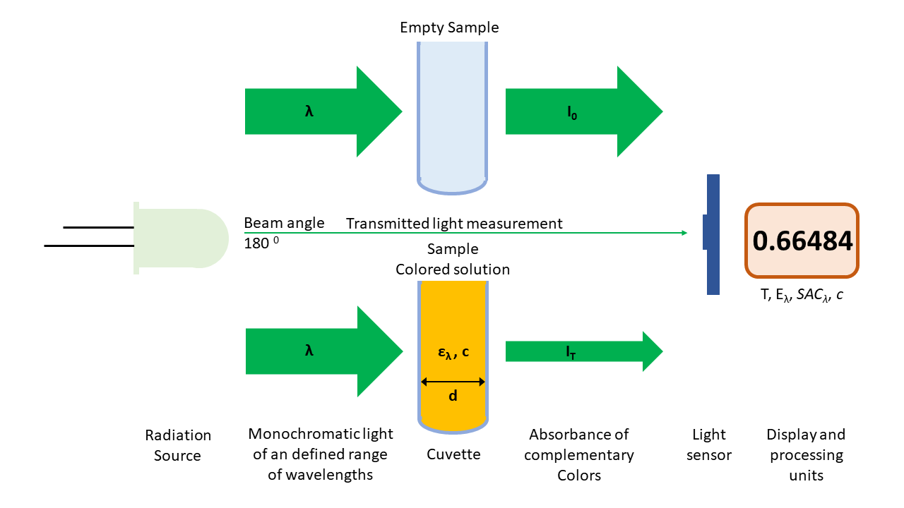
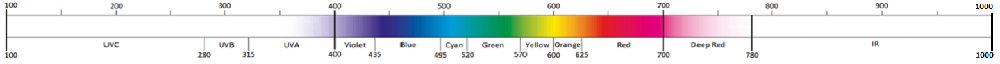

# smartPhotometer

Easy-to-use OpenSource LED photometers for measurement of the absorption of light of a given wavelength (or a given range of wavelengths) of colored or not colored substances in solution.

smartPhotometer for analytics of aqueous solutions works with ultraviolet, visible and infrared light ranges, by wavelengths around 375 up to 850 nm.

**Turbidity – a source of error** 
The turbidity of a sample is often underestimated, because often it is not possible to see it visually. 
**The nephelometric turbidity of a sample is measured and displayed for every single measurement automatically.**

Due to their wide range of application, their reliability and robustness, smartPhotometers **can be perfectly used as portable analytical instruments for outdoor analytics**.

**Your insurance for secure measurement results.**

## Reducing complexity

In simple terms, photometry is a measurement method for determining the concentration of colored solutions with the aid of electromagnetic radiation (“light”).

The two most common types of photometers are:

- Spectrophotometer
- Filter photometer

In spectrophotometers a monochromator (with prism or with grating) is used to obtain monochromatic light of defined wavelengths. They can also be used to scan the spectrum of the absorbing substance.

In filter photometers, optical filters are used to give the monochromatic light.

Due to the evolution and availability of **various types of LEDs** it is easily possible **to obtain nearly monochromatic light with specific wavelength ranges**, but
without the need to setup an complex and sensitive monochromator or filter mechanismn.

Reducing of complexity
- by using **RGB, UV and IR LEDs for the parallel measurement of absorption and nephelometric turbidity** at different wavelengths.
- by the integration of various **digital light sensors orchestrated by simple microcontrollers**.
- by distributing different analysis methods **on multiple meshed photometers**.
- by the strict **segregation of data acquisition, transmission, analytics and their visualisation** on different layers and devices.

## Being Smart - The difference
Connect the smartPhotometers microcontrollers (including their connected LED fireworks and light sensors) via WiFi to your internal network and orchestrate them by using simple web- or MQTT-based APIs.

Any device (e.g. PC, Laptop, Tablet, smartPhone, ...) with a standard web browser can be used to access a simple web page on the smartPhotometers.

A Javascript application will start within your browser and is triggering and managing all analytis, evaluation of measured values and their visualisation.

### Environmental monitoring
Monitor and secure your environment in real time with online monitoring by logging readings into a central database with MQTT-based APIs.

### Absorbance measurement

The principle of absorption photometers is that (as far as possible) monochromatic light is allowed to pass through a cuvette containing the solution. It then reaches a light sensor, that measures the intensity of the light compared to the intensity after passing through an identical cuvette with the same solvent but without the colored substance. From the ratio between the light intensities, knowing the capacity of the colored substance to absorb light, it is possible to calculate the concentration of the substance using Lambert-Beer's law.

<table>
  <tr>
    <td>
    <td>
  </tr>
<tr>
<td>λ</td>
<td>Wavelength [nm]</td>
</tr>
<tr>
<td><var>Bo</var></td>
<td>
	Beam (measuring) angle [<var>o</var>] 
	<var>180 o: Transmitted light measurement (Absorbance)</var> 
	<var>90 o: Nephelometric turbidity (scattered light) measurement</var>
</td>
</tr>
<tr>
<td><var>I0</var></td>
<td>Intensity of incident light [lux]</td>
</tr>
<tr>
<td><var>IT</var></td>
<td>Intensity of transmitted light [lux]</td>
</tr>
<tr>
<td>T = <var>IT</var> / <var>I0</var></td>
<td>
	Transmission 
	Energy passing through 
	Range: 0.0 - 1.0
</td>
</tr>
<tr>
<td>A = 1 - T</td>
<td>
	Absorption 
	Energy lost
</td>
</tr>
<tr>
<td><var>Eλ</var> = - log ( T ) = <var>ελ</var> * c * d</td>
<td>
	Absorbance 
	Attenuation 
	Lambert-Beer law 
	Optimum range: 0.1 – 1.0
</td>
</tr>
<tr>
<td><var>SACλ</var> = <var>Eλ</var> / d * 100</td>
<td>Spectral Absorption Coefficient [<var>m-1</var>]</td>
</tr>
<tr>
<td>c = <var>Eλ</var> / ( <var>ελ</var> * d ) = <var>Eλ</var> * F</td>
<td>Concentration of absorbing substance in the liquid [mol/l]</td>
</tr>
<tr>
<td>F = 1 / ( <var>ελ</var> * d )</td>
<td>
	Factor 
	Test specific
</td>
</tr>
<tr>
<td><var>ελ</var></td>
<td>Molar decadic extinction coefficient [l/mol/cm]</td>
</tr>
<tr>
<td>d</td>
<td>Thickness of the solution layer [cm]</td>
</tr>
</table>

#### Electromagnetic radiation used for photometric analysis

Various types of LEDs are used to select the optimum wavelength range for the respective measurement.

- The selection of the optimum wavelength range depends on the color of the sample solution and the associated absorption of the complementary color.
- For a blue solution, a wavelength range near to yellow should be used (green LED), while for a yellow solution a blue LED should be used, since always the complementary color is absorbed.
- The more closely the absorption maximum of the substance to be detected is approached, the higher the performance of the photometer will be.
- The smaller the spectral bandwidth of the LED (the range between lower and upper wavelength), the higher the photometer resolution.

The selection of an appropriate cuvette for each measurement is crucial. The material (depending on the wavelength) and size of the cuvette are the two key factors.

- High-quality materials such as quartz are used in rectangular standard cuvettes for measurements in the UV range.
- In addition to round and rectangular cuvettes, there are also special cuvettes, such as flow-through cuvettes, where the sample solution is passed into and out of the cuvette by a pump.
- The size of the cuvette is directly related to the layer thickness that is effective in the Lambert-Beer law. Generally speaking, the larger the cuvette and the sample volume, the greater the layer thickness, and the more sensitive the measurement can be.

<table>
<tr>
  <td colspan=6>

</tr>
<tr>
  <td colspan=6><b>Ultraviolet radiation</b>
</tr>
<tr>
  <td>
  <td>100-280 nm
  <td colspan=2>UVC
  <td rowspan=2>UV transmitting quartz glass cuvette > 190 nm
  <td rowspan=3>Numerous inorganic and organic compounds absorb light especially in the ultraviolet and visible range.
</tr>
<tr>
  <td>
  <td>280-315 nm
  <td colspan=2>UVB
</tr>
<tr>
  <td>
  <td>315-400 nm
  <td colspan=2>UVA
  <td>Borosilicate glass cuvette > 290 nm
</tr>
<tr>
  <td colspan=6><b>Colors of light and complementary colors</b>
</tr>
<tr>
  <td>
  <td>400–435 nm
  <td>Violet
  <td>Yellow-Green
  <td rowspan=9>Normal glass (soda-lime glass) cuvette > 350 nm
  <td rowspan=8>Numerous inorganic and organic compounds absorb light especially in the ultraviolet and visible range.
</tr>
<tr>
  <td>
  <td>435–495 nm
  <td>Blue
  <td>Yellow
</tr>
<tr>
  <td>
  <td>495–520 nm
  <td>Cyan (Blue-Green)
  <td>Red
</tr>
<tr>
  <td>
  <td>520–570 nm
  <td>Green
  <td>Violet
</tr>
<tr>
  <td>
  <td>570–600 nm
  <td>Yellow
  <td>Blue
</tr>
<tr>
  <td>
  <td>600–625 nm
  <td>Orange
  <td>Cyan (Blue-Green)
</tr>
<tr>
  <td>
  <td>625–700 nm
  <td>Red
  <td>Cyan (Blue-Green)
</tr>
<tr>
  <td>
  <td>700–780 nm
  <td>Deep Red
  <td>Cyan (Blue-Green)
</tr>
<tr>
  <td>
  <td>> 780 nm
  <td>Infrared
  <td>Black
  <td>Nephelometric turbidity measurement
</tr>
</table>

### Color measurement
- Conversions of color index and display in color space
- Measuring of color difference against quality control standards

### Turbidity measurement
- Absorbance measurement (transmitted light measurement) at a 180° angle from 2-400 NTU
- Nephelometric stray light measurement from 0.1-1000 NTU

<table>
  <tr>
    <td colspan=2>
  </tr>
<tr>
<td>λ</td>
<td>Wavelength [nm]</td>
</tr>
<tr>
<td><var>Bo</var></td>
<td>
	Beam (measuring) angle [<var>o</var>] 
	<var>180 o: Transmitted light measurement (Absorbance)</var> 
	<var>90 o: Nephelometric turbidity (scattered light) measurement</var>
</td>
</tr>
<tr>
<td><var>I0</var></td>
<td>Intensity of incident light [lux]</td>
</tr>
<tr>
<td><var>IT</var></td>
<td>Intensity of transmitted light [lux]</td>
</tr>
<tr>
<td>T = <var>IT</var> / <var>I0</var></td>
<td>
	Transmission 
	Energy passing through 
	Range: 0.0 - 1.0
</td>
</tr>
<tr>
<td>A = 1 - T</td>
<td>
	Absorption 
	Energy lost
</td>
</tr>
<tr>
<td><var>Eλ</var> = - log ( T ) = <var>ελ</var> * c * d</td>
<td>
	Absorbance 
	Attenuation 
	Lambert-Beer law 
	Optimum range: 0.1 – 1.0
</td>
</tr>
<tr>
<td><var>SACλ</var> = <var>Eλ</var> / d * 100</td>
<td>Spectral Absorption Coefficient [<var>m-1</var>]</td>
</tr>
<tr>
<td>c = <var>Eλ</var> / ( <var>ελ</var> * d ) = <var>Eλ</var> * F</td>
<td>Concentration of absorbing substance in the liquid [mol/l]</td>
</tr>
<tr>
<td>F = 1 / ( <var>ελ</var> * d )</td>
<td>
	Factor 
	Test specific
</td>
</tr>
<tr>
<td><var>ελ</var></td>
<td>Molar decadic extinction coefficient [l/mol/cm]</td>
</tr>
<tr>
<td>d</td>
<td>Thickness of the solution layer [cm]</td>
</tr>
<tr>
<td>Turbidity</td>
<td>Opacity, clouding, haze</td>
</tr>
<tr>
<td>FNU</td>
<td>Formazine Nephelometric Unit</td>
</tr>
<tr>
<td>NTU</td>
<td>Nephelometric Turbidity Unit</td>
</tr>
<tr>
<td>FAU</td>
<td>Formazine Attenuation Unit</td>
</tr>
</table>

#### NTU check
- Safely spot interfering turbidities
- Unique for maximum measurement result safety
- Runs automatically with each measurement

smartPhotometer are in this way cheap, robust and easy-to-use, but very flexible and also provide multiple analysis and reporting options which normally are only available in very expensive high end solutions.

Don't reinvent the wheel and **rely on agile open source communities**.

## Datasheet

<table>
<tr>
  <td colspan=2><b>Measuring modes</b>
  <td><b>UV SAC</b>
  <td><b>Color</b>
  <td colspan=4><b>VIS SAC / Turbidity</b>
  <td colspan=2><b>Turbidity</b>
</tr>
<tr>
  <td>
  <td>Target wavelength
  <td>254 nm
  <td>VIS
  <td colspan=3>VIS, 436 nm
  <td>850 nm
  <td>850 nm
  <td>850 nm
</tr>
<tr>
  <td colspan=12>
</tr>
<tr>
  <td>
  <td>100-400 nm
  <td>UV
  <td>
  <td colspan=4>
  <td colspan=2>
</tr>
<tr>
  <td>
  <td>400-780 nm
  <td>
  <td>VIS
  <td colspan=3>VIS
  <td>
  <td colspan=2>
</tr>
<tr>
  <td>
  <td>> 780 nm
  <td>
  <td>
  <td colspan=3>
  <td>IR
  <td>IR
  <td>IR
</tr>
<tr>
  <td colspan=2><b>Device</b>
  <td><b>smart-UV-Photometer</b>
  <td><b>smart-Colorimeter</b>
  <td colspan=4><b>smart-RGB-Photometer</b>
  <td colspan=2><b>smart-IR-Turbidimeter</b>
</tr>
<tr>
  <td>
  <td>Measurement method
  <td>Absorbance
  <td>Color index
  <td colspan=3>Absorbance
  <td>Nephelometric turbidity
  <td>Absorbance
  <td>Nephelometric turbidity
</tr>
<tr>
  <td>
  <td>Beam angle [o]
  <td>180
  <td>180
  <td colspan=3>180
  <td>90
  <td>180
  <td>90
</tr>
<tr>
  <td>
  <td>LED(s) and Sensor chip mounting height [mm]
  <td colspan=8>20.0
</tr>
<tr>
  <td colspan=2><b>Readings</b>
  <td>
  <td>
  <td colspan=4>
  <td colspan=2>
</tr>

<tr>
  <td>
  <td>Illuminance (<var>EV</var>) [lux = lm/<var>m2</var>]
  <td>X
  <td>
  <td>X
  <td>X
  <td>X
  <td>X
  <td>X
  <td>X
</tr>
<tr>
  <td>
  <td>Color index
  <td>
  <td>RGB
  <td colspan=4>
  <td colspan=2>
</tr>
<tr>
  <td>
  <td>Light color temperature [K]
  <td>
  <td>X
  <td colspan=4>
  <td colspan=2>
</tr>
<tr>
  <td colspan=2><b>LED(s)</b>
  <td><a href='https://www.nichia.co.jp/specification/products/led/NSPU510CS-E.pdf'>NSPU510CS</a>
  <td><a href='https://cdn.luckylight.cn/media/component/data-sheet/504WC2E-W6-3PC.pdf'>504WC2E-W6-3PC</a>
  <td colspan=3><a href='https://cdn-reichelt.de/documents/datenblatt/A500/LL-509RGBC2E-006.pdf'>LL-509RGBC2E-006</a>
  <td><a href='https://cdn-reichelt.de/documents/datenblatt/A501/HIR383C-L289_ENG_TDS.pdf'>HIR383C-L289</a>
  <td colspan=2>2 x <a href='https://cdn-reichelt.de/documents/datenblatt/A501/HIR383C-L289_ENG_TDS.pdf'>HIR383C-L289</a>
</tr>
<tr>
  <td>
  <td>Light color
  <td>UVA
  <td>Warm White
  <td>Red
  <td>Green
  <td>Blue
  <td>IR
  <td>IR
  <td>IR
</tr>
<tr>
  <td>
  <td>Wavelength (<var>λP</var>) [nm]
  <td>375
  <td>410-780
  <td>626
  <td>525
  <td>470
  <td>850
  <td>850
  <td>850
</tr>
<tr>
  <td>
  <td>Spectrum half width (Δλ) [nm]
  <td>9
  <td>
  <td>20
  <td>40
  <td>26
  <td>45
  <td>45
  <td>45
</tr>
<tr>
  <td>
  <td>Luminous intensity <var>IV</var> [mcd] (by I = 12 mA)
  <td>
  <td>13800
  <td>1920
  <td>2400
  <td>1200
  <td>
  <td colspan=2>
</tr>
<tr>
  <td>
  <td>Luminous flux (<var>ΦV</var>) [lm]
  <td>
  <td>
  <td>1.0
  <td>1.2
  <td>0.6
  <td>
  <td colspan=2>
</tr>
<tr>
  <td>
  <td>Viewing angle (2θ) [o]
  <td>15
  <td>40
  <td colspan=3>25
  <td>18
  <td colspan=2>18
</tr>
<tr>
  <td>
  <td>Ø [mm]
  <td colspan=8>5
</tr>
<tr>
  <td>
  <td>Length [mm]
  <td>8.3
  <td>8.65
  <td colspan=3>8.6
  <td>8.6
  <td colspan=2>8.6
</tr>
<tr>
  <td>
  <td>Long leg
  <td>Anode (+)
  <td>Anode (+)
  <td colspan=3>Common Cathode (-)
  <td>Anode (+)
  <td colspan=2>Anode (+)
</tr>
<tr>
  <td>
  <td><var>IF</var> [mA]
  <td>20
  <td>25
  <td colspan=3>35
  <td>100
  <td colspan=2>100
</tr>
<tr>
  <td>
  <td><var>VR</var> [V]
  <td>4
  <td>5
  <td colspan=3>5
  <td>5
  <td colspan=2>5
</tr>
<tr>
  <td>
  <td><var>VF</var> [V] (by I = 12 mA)
  <td>3.4
  <td>2.9
  <td>1.93
  <td>2.9
  <td>3.4
  <td>1.3
  <td colspan=2>1.3
</tr>
<tr>
  <td>
  <td>Calculated series resistor [Ω]
  <td>0
  <td>33.3
  <td>114.2
  <td>33.3
  <td>0
  <td>175
  <td colspan=2>175
</tr>
<tr>
  <td>
  <td>Series resistor [Ω]
  <td>0
  <td>62
  <td>182
  <td>62
  <td>0
  <td>182
  <td colspan=2>182
</tr>
<tr>
  <td>
  <td>GPIO
  <td>12
  <td>12
  <td>12
  <td>13
  <td>14
  <td>23
  <td>12
  <td>23
</tr>
<tr>
  <td colspan=2><b>Cuvette</b>
  <td><a href='https://www.amazon.de/gp/product/B07NNGHKSC/ref=ppx_yo_dt_b_asin_title_o04_s00?ie=UTF8&psc=1'>UV quartz cuvette</a>
  <td>Borosilicate glass
  <td colspan=4>Normal glass (soda-lime glass)
  <td colspan=2>Normal glass (soda-lime glass)
</tr>
<tr>
  <td>
  <td>Material
  <td>UV transmitting quartz
  <td>Borosilicate glass
  <td colspan=4>Normal glass (soda-lime glass)
  <td colspan=2>Normal glass (soda-lime glass)
</tr>
<tr>
  <td>
  <td>Chemical and heat resistant
  <td colspan=8>Yes
</tr>
<tr>
  <td>
  <td>Transmission range [nm]
  <td>190-2500
  <td>290-2500
  <td colspan=4>350-2500
  <td colspan=2>350-2500
</tr>
<tr>
  <td>
  <td>Form
  <td>Square
  <td>Round
  <td colspan=4>Round
  <td colspan=2>Round
</tr>
<tr>
  <td>
  <td>Polished sidewalls
  <td>2
  <td>N/A
  <td colspan=4>N/A
  <td colspan=2>N/A
</tr>
<tr>
  <td>
  <td>L x W x H [mm]
  <td>12.5 x 12.5 x 45.0
  <td>N/A
  <td colspan=4>N/A
  <td colspan=2>N/A
</tr>
<tr>
  <td>
  <td>Ø x H [mm]
  <td>N/A
  <td>16.0 x 200.0
  <td colspan=4>16.0 x 200.0
  <td colspan=2>16.0 x 200.0
</tr>
<tr>
  <td>
  <td>Wall thickness [mm]
  <td>1.25
  <td>1.00
  <td colspan=4>1.00
  <td colspan=2>1.00
</tr>
<tr>
  <td>
  <td>Light path length [mm]
  <td>10.0
  <td>14.0
  <td colspan=4>14.0
  <td colspan=2>14.0
</tr>
<tr>
  <td>
  <td>Sample volume [ml]
  <td>3.5
  <td>>5
  <td colspan=4>>5
  <td colspan=2>>5
</tr>
<tr>
  <td colspan=2><b>Light sensor</b>
  <td><a href='https://www.vishay.com/docs/84277/veml6070.pdf'>VEML6070</a>
  <td><a href='https://cdn-shop.adafruit.com/datasheets/TCS34725.pdf'>TCS34725</a>
  <td colspan=4><a href='https://cdn-shop.adafruit.com/datasheets/TSL25911_Datasheet_EN_v1.pdf'>TSL2591</a>
  <td colspan=2><a href='https://cdn-shop.adafruit.com/datasheets/TSL25911_Datasheet_EN_v1.pdf'>TSL2591</a>
</tr>
<tr>
  <td>
  <td>Wavelength (<var>λP</var>) [nm]
  <td>355
  <td>525
  <td colspan=3>650
  <td>850
  <td colspan=2>850
</tr>
<tr>
  <td>
  <td>Spectrum half width (Δλ) [nm]
  <td>20
  <td>125
  <td colspan=3>150
  <td>42
  <td colspan=2>42
</tr>
<tr>
  <td>
  <td>Spectrum range (<var>λR</var>) [nm]
  <td>320-380
  <td>380-780
  <td colspan=3>380-780
  <td>780-910
  <td colspan=2>780-910
</tr>
<tr>
  <td>
  <td>Voltage [V]
  <td colspan=8>3.3-5.0
</tr>
<tr>
  <td>
  <td>I2C GPIO
  <td colspan=8>SCL: 5 SDA: 4
</tr>
<tr>
  <td>
  <td>I2C address
  <td>0x10
  <td>0x29
  <td colspan=4>0x29
  <td colspan=2>0x29
</tr>
<tr>
  <td>
  <td>L x W x H [mm]
  <td>13.0 x 12.0 x 2.0
  <td>20.3 x 20.3 x 2.0
  <td colspan=4>19.0 x 16.5 x 2.0
  <td colspan=2>19.0 x 16.5 x 2.0
</tr>
<tr>
  <td colspan=2><b>Microcontroller</b>
  <td colspan=8><a href='https://cdn.shopify.com/s/files/1/1509/1638/files/ESP_-_32_NodeMCU_Developmentboard_Datenblatt_AZ-Delivery_Vertriebs_GmbH_10f68f6c-a9bb-49c6-a825-07979441739f.pdf?v=1598356497'>ESP32-WROOM-32 NodeMCU WLAN/WiFi</a>
</tr>
<tr>
  <td>
  <td>L x W x H [mm]
  <td colspan=8>48.3 x 25.4 x 10.0
</tr>
<tr>
  <td>
  <td>Firmware
  <td colspan=8><a href='/firmware/bin/ESP_Easy_mega_20201102_test_ESP32_4M316k-factory.bin'>ESP_Easy_mega_20201102_test_ESP32_4M316k-factory.bin</a>
</tr>
<tr>
  <td>
  <td>Update
  <td colspan=8><a href='/firmware/bin/ESP_Easy_mega_20201102_test_ESP32_4M316k-factory.bin'>Via Web-GUI by using OTA (Over the Air)</a>
</tr>
<tr>
  <td colspan=2><b>Case</b>
  <td colspan=8>OpenSCAD 3D model (<a href='./setup/case/smartPhotometer-3d-model.scad'>smartPhotometer-3d-model.scad</a>)
</tr>
<tr>
  <td>
  <td>3D printing
  <td colspan=8>via STL exports
</tr>
<tr>
  <td>
  <td>Filament
  <td colspan=8>Black PLA
</tr>
<tr>
  <td>
  <td>Layer height [mm]
  <td colspan=8>0.2
</tr>
<tr>
  <td rowspan=4>
  <td rowspan=4>STL exports
  <td><a href='./setup/case/3d-printing/smart-UV-Photometer-Case.stl'>smart-UV-Photometer-Case.stl</a>
  <td><a href='./setup/case/3d-printing/smart-Colorimeter-Case.stl'>smart-Colorimeter-Case.stl</a>
  <td colspan=4><a href='./setup/case/3d-printing/smart-RGB-Photometer-Case.stl'>smart-RGB-Photometer-Case.stl</a>
  <td colspan=2><a href='./setup/case/3d-printing/smart-IR-Turbidimeter-Case.stl'>smart-IR-Turbidimeter-Case.stl</a>
</tr>
<tr>
  <td colspan=8><a href='./setup/case/3d-printing/smartPhotometer-Case-Lid.stl'>smartPhotometer-Case-Lid.stl</a>
</tr>
<tr>

  <td colspan=8><a href='./setup/case/3d-printing/smartPhotometer-Cover-for-square-Cuvette.stl'>smartPhotometer-Cover-for-square-Cuvette.stl</a>
</tr>
<tr>
  <td><a href='./setup/case/3d-printing/smart-UV-Photometer-Cuvette-Holder.stl'>smart-UV-Photometer-Cuvette-Holder.stl</a>
  <td><a href='./setup/case/3d-printing/smart-Colorimeter-Cuvette-Holder.stl'>smart-Colorimeter-Cuvette-Holder.stl</a>
  <td colspan=4><a href='./setup/case/3d-printing/smart-RGB-Photometer-Cuvette-Holder.stl'>smart-RGB-Photometer-Cuvette-Holder.stl</a>
  <td colspan=2><a href='./setup/case/3d-printing/smart-IR-Turbidimeter-Cuvette-Holder.stl'>smart-IR-Turbidimeter-Cuvette-Holder.stl</a>
</tr>
</table>
 
 smartPhotometer by <a xmlns:cc="http://creativecommons.org/ns#" href="https://github.com/smartaquametering" property="cc:attributionName" rel="cc:attributionURL">smartAquaMetering</a> is licensed under a <a rel="license" href="http://creativecommons.org/licenses/by-sa/4.0/">Creative Commons Attribution-ShareAlike 4.0 International License</a>. Based on a work at <a xmlns:dct="http://purl.org/dc/terms/" href="https://github.com/smartaquametering/smartPhotometer" rel="dct:source">https://github.com/smartaquametering/smartPhotometer</a>. For permissions beyond the scope of this license see <a xmlns:cc="http://creativecommons.org/ns#" href="https://github.com/smartaquametering/smartPhotometer/blob/main/LICENSE" rel="cc:morePermissions">https://github.com/smartaquametering/smartPhotometer/blob/main/LICENSE</a>.
