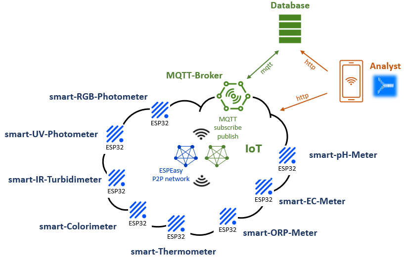

# smartAquaMeter

Easy-to-use OpenSource AquaMeter for measurement of various analytical parameters.
Due to their wide range of application, their reliability and robustness, smartAquaMeters **can be perfectly used as portable analytical instruments for outdoor analytics**.

**Your insurance for secure measurement results.**

## Reducing complexity

Reducing of complexity
- by using **RGB, UV and IR LEDs for the parallel measurement of absorption and nephelometric turbidity** at different wavelengths.
- by the integration of various **digital light sensors and electrochemical sondenxxxxxx orchestrated by simple microcontrollers**.
- by distributing different analysis methods **on multiple meshed smartAquaMeters**.
- by the strict **segregation of data acquisition, transmission, analytics and their visualisation** on different layers and devices.

## Being Smart - The difference

Connect the smartAquaMeters microcontrollers (including their connected sensors) via WiFi to your internal network and orchestrate them by using simple web- or MQTT-based APIs.

Any device (e.g. PC, Laptop, Tablet, smartPhone, ...) with a standard web browser can be used to access a simple web page on the smartAquaMeters.

A Javascript application will start within your browser and is triggering and managing all analytis, evaluation of measured values and their visualisation.

## ESPEasy P2P network

<table>
<tr>
  <td><b>Device</b>
</tr>
<tr>
  <td><b>smart-RGB-Photometer</b>
</tr>
<tr>
  <td><b>smart-UV-Photometer</b>
</tr>
<tr>
  <td><b>smart-IR-Turbidimeter</b>
</tr>
<tr>
  <td><b>smart-Colorimeter</b>
</tr>
  <td><b>smart-pH-Meter</b>
<tr>
  <td><b>smart-EC-Meter</b>
</tr>
<tr>
  <td><b>smart-ORP-Meter</b>
</tr>
<tr>
  <td><b>smart-Thermometer</b>
</tr>
</table>
 
 smartPhotometer by <a xmlns:cc="http://creativecommons.org/ns#" href="https://github.com/smartaquametering" property="cc:attributionName" rel="cc:attributionURL">smartAquaMetering</a> is licensed under a <a rel="license" href="http://creativecommons.org/licenses/by-sa/4.0/">Creative Commons Attribution-ShareAlike 4.0 International License</a>. Based on a work at <a xmlns:dct="http://purl.org/dc/terms/" href="https://github.com/smartaquametering/smartPhotometer" rel="dct:source">https://github.com/smartaquametering/smartPhotometer</a>. For permissions beyond the scope of this license see <a xmlns:cc="http://creativecommons.org/ns#" href="https://github.com/smartaquametering/smartPhotometer/blob/main/LICENSE" rel="cc:morePermissions">https://github.com/smartaquametering/smartPhotometer/blob/main/LICENSE</a>.
